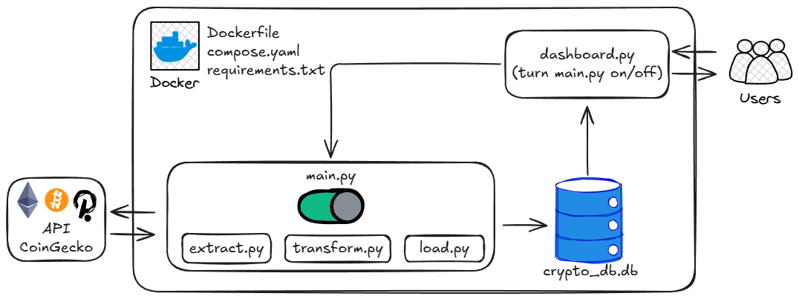
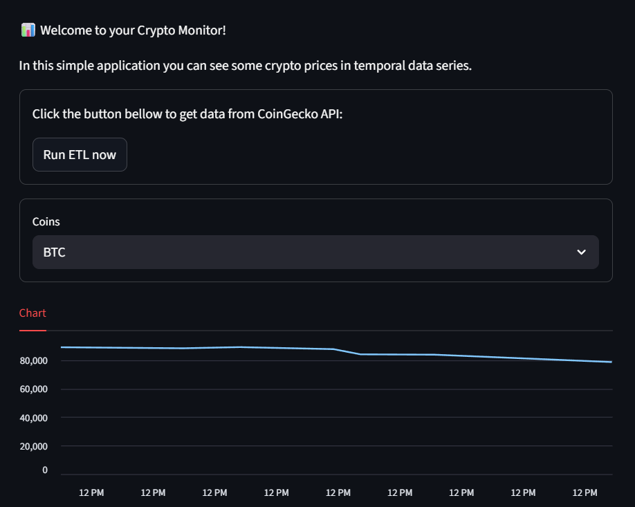

# crypto_etl

A simple data engineering project from CoinGecko API to streamlit.

# Quick Start

Firts step, `git clone` this repo using the command bellow:

```bash
git clone https://github.com/GMSantos4/crypto_etl.git
```

After that, inside the `crypto_etl` directory, run the command bellow:

```bash
# first time
docker compose up --build

# other times
docker compose up
```

The application will be exposed in the port 8501. You only need to access in your browser the address `localhost:8501`. 

If you want to finish the application, do a `CTRL-C` in the CLI. It will stop the container gracefully. After that, just run the command bellow:

```bash
docker compose down
```

This command will remove the container and the networks. The volumes won't be removed once it is important to persist the saved data.

# Architecture (core business)

The project has the following structure:

```text
CRYPTO_ETL
├── app/
│   ├── __init__.py
│   ├── dashboard.py
│   ├── extract.py
│   ├── load.py
│   ├── main.py
│   └── transform.py
├── assets/
├── data/
│   └── crypto_db.db
├── compose.yaml
├── Dockerfile
├── README.md
└── requirements.txt
````

In the figure bellow you can see how each file in this structure interact one with each other.



The core business of this app is made by `main.py`:
```python
from extract import fetch_crypto_data
from transform import transform_data
from load import save_to_db

def run_full_etl():
    """
    This function get data from CoinGecho API
    """
    print("STARTING DATA UPDATING...")
    data = fetch_crypto_data()
    cleaned_data = transform_data(data)
    save_to_db(cleaned_data)
    print('DATA UPDATED!')

if __name__ == "__main__":
    run_full_etl()
```

As you can see, `main.py` run the full ETL (extract, transform and load data) by running the `run_full_etl` function.

In `main.py`, we extract values from the CoinGecko API using the `fetch_crypto_data` function. This function make a request to the `/coins/markets/` endpoint of the API and receive a `.json` file with the first 25 coins according with the markert cap.

After that, the `.json` file received is transformed by `transform_data` function. This function filters and maps five specific features from the raw `.json` to a structured format in the database (`name_id`, `symbol`, `price`, `market_cap`, and `timestamp`).

After be transformed, these features are saved in the database by `save_to_db` function. Besides saving data inside the database by `save_to_db` function, the `load.py` scripts creates the database using `SQLAlchemy` library.

`SQLAlchemy` abstracts the SQL query `CREATE TABLE...` by python classes:
```python
Base = declarative_base()

class CryptoPrice(Base):
    __tablename__ = 'crypto_prices'
    id = Column(Integer,primary_key=True,autoincrement=True)
    name_id = Column(String)
    symbol = Column(String)
    price = Column(Float)
    market_cap = Column(Float)
    timestamp = Column(DateTime, default=datetime.datetime.now())
```
Database connections, commits and closes are also abstracted by python objects and its methods.

Once the data are saved in the database, it can be presented in the dashboard. All this orchestration are made by `dashboard.py`. This script creates the front-end using `streamlit` library, a very easy way to display your data. Inside `dashboard.py` there are two functions created to querying the database: `get_temporal_serie_data` and `get_cryptocoin_id`. 

Bellow you can see a print of the dashboard working:



Every time you click the 'Run ETL now' button, the `run_full_etl` function from main.py is called. This triggers the ingestion process, adding new values to the time series of each coin inside the database.

Every time you choose a Coin in the dropdown menu "Coins", the data serie of the chosen coin is loaded in the chart bellow.

That's how the program works. 

All this were containerized in Docker Containers. For this, two main files were used: `Dockerfile` and `compose.yaml`.

`Dockerfile` is the recipe to create the application Image, containing all dependencies and environment configurations.

Once the image is created, you'll need to run the container if you want to use the application. You can use `docker run...` with all its flags to initialize the container. Or you can use the `docker compose` substituting all this `docker run` flags by a `compose.yaml` file.

`compose.yaml` file encapsulates all the specifications to run a container. With this, you need just write a `docker compose up` command to initialize the container (once it is already built).

# Technologies

Some of the used technologies were: Python, Docker, Docker Compose, SQLAchemy, Streamlit, Git, GitHub and SQLIte.

# Technical Choices

Here goes some reasons why some technologies were chosen:

## Docker and Docker Compose

The main reason to choose Docker was to allow this application be portable in other machines and how easy is to run the application with Docker Compose.

## `python:3.12-slim` image

This image was chosen to minimize the final image footprint and optimize build time, following containerization best practices.

## `streamlit`

My main goal was to create an robust ETL process without worry about the front-end. So I decided to use the `streamlit` library once it is very easy to create wonderful application without much code.

# Nexts steps

This application doesn't explore so much about networks. A next step could be to create a container with the database splited from the main container.